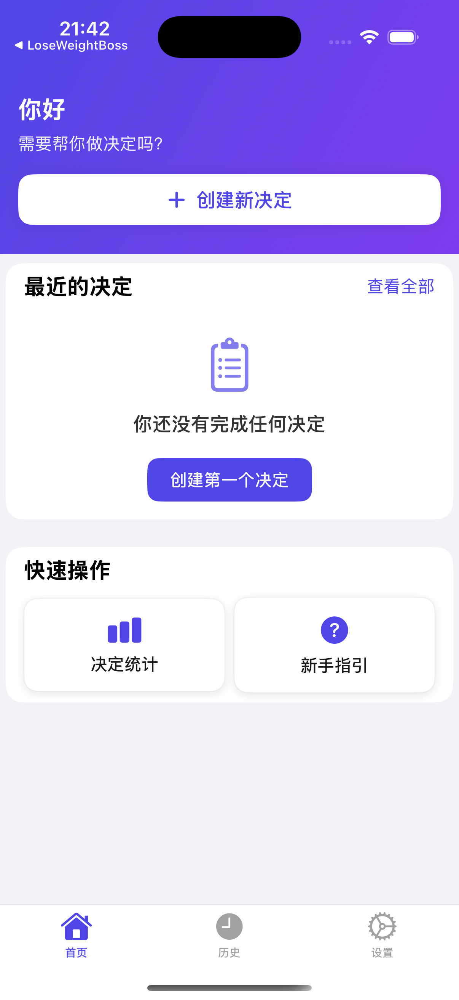
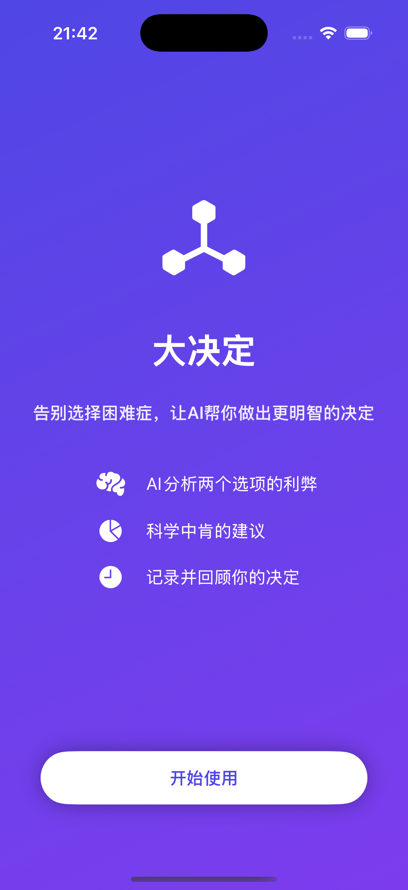
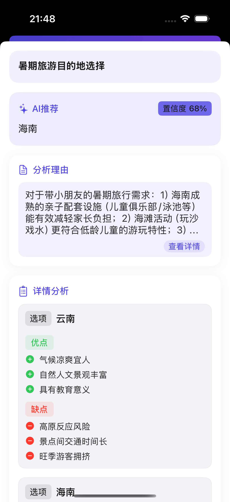
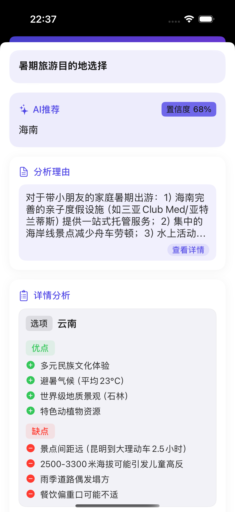
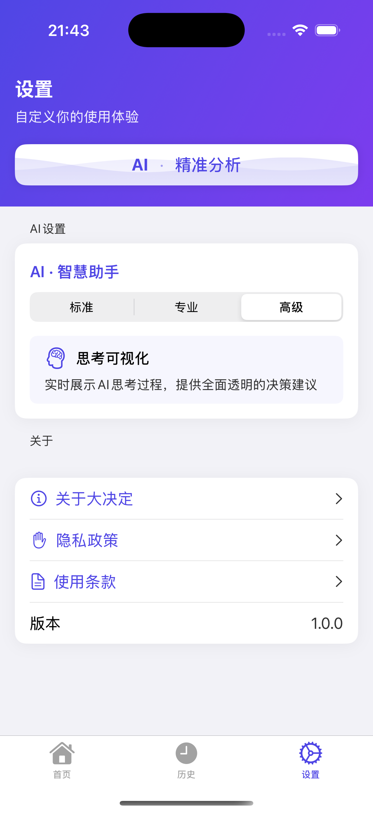
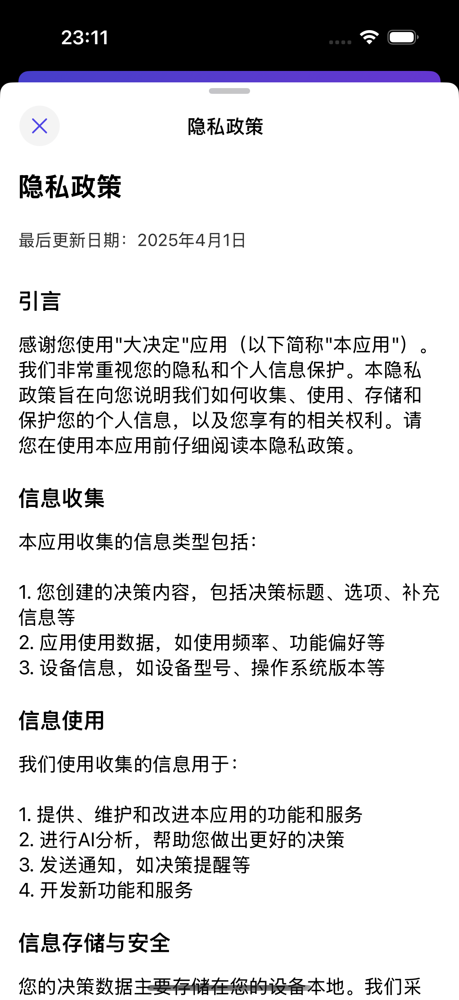
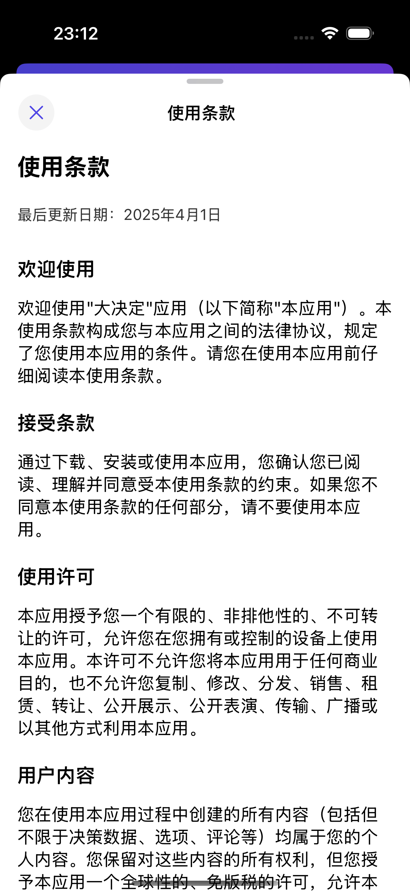

# 小决定-AI分析 - 让决策更简单

在这个充满选择的世界里，我们常常面临复杂的决策困境。BigDecision作为一款智能决策辅助工具，致力于帮助用户通过结构化思考做出更明智的选择。

## 功能介绍

### 欢迎页面

### 决策矩阵
科学的决策矩阵系统，通过加权标准对不同选项进行量化评估，让复杂决策变得清晰可见。

### 可视化分析
直观的图表和图形展示，帮助您快速理解各个选项的优劣势对比。

### 利弊分析
详细的利弊对比功能，帮助您全面考量每个选择的优缺点。

### 个性化设置
丰富的自定义选项：
- 决策模板创建
- 评分标准定制
- 界面主题切换
- 数据导出格式选择

## 核心功能

### 决策库
保存和管理您的所有决策，随时回顾和修改。

### 协作决策
支持多人协作功能，邀请朋友、家人或同事共同参与重要决策。

### 智能建议
基于您的偏好和历史决策，提供个性化建议和洞见。

## 系统设置

全面的配置选项：
- 数据同步设置
- 通知管理
- 隐私控制
- 导出与备份

# 核心特色

- 【科学】基于决策科学理论，提供结构化思考框架
- 【直观】清晰的可视化展示，让决策过程一目了然
- 【全面】支持iOS/Android/Web多平台使用
- 【协作】支持团队协作，集思广益
- 【安全】严格的数据保护措施，保障您的决策隐私
- 【灵活】提供免费版和高级订阅版，满足不同需求